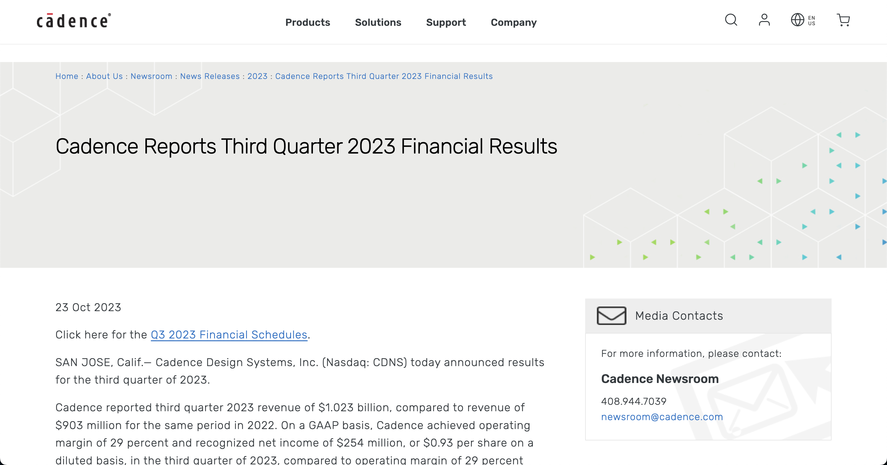

# Problem-1 integrated circuit company

## IC company in U.S. stocks and A-share china

### U.S. stock

> I choose the company in [the list of S&P500 companies](https://en.wikipedia.org/wiki/List_of_S%26P_500_companies)


#### EX of teacher - Texas Instruments
All the data comes from ["earning & annual report"](https://investor.ti.com/static-files/677a654b-c544-4394-a09c-24a93c32aec7) of TI

- **Type:** Chip design, manufacture and sale
- **Revenue:** US$20.03 billion(2022)
    > 
- **Profits:** US$8.75 billion(2022)
    > 
    > 
    > 
- **Market capitalization:** US$130.02 billion (2023.11.2) (source:[companiesmarketcap.com](https://companiesmarketcap.com/texas-instruments/marketcap/))
  
- **Number of employees:** 33,000(2022)
    > 

---

#### Its game that change the world - Nvidia
- **Type:** graphics processors and chipsets
- **Revenue:** US$26.974 billion(2022)
    > 
- **Profits:** US$4368 million(2022)
    > 
- **Market capitalization:** US$1.072 trillion (2023.11.2) (source:[companiesmarketcap.com](https://companiesmarketcap.com/nvidia/marketcap/))
- **Number of employees:** 26,196(2023)
    > 

---

#### Last semiconductor company on S&P500 - First Solar
- **Type:** Solar panal manufacture, solution provider and services supporting
- **Revenue:** US$17.7 billion (2022)
    > 
- **Profits:** not found
- **Market capitalization:** US$15.71 billion (2023.11.2) (source:[companiesmarketcap.com](https://companiesmarketcap.com/first-solar/marketcap/))
- **Number of employees:** 5,500
  > 

---

#### Apple make chips - Apple
- **Type:** phone, pc, MR devices and some vedio content
- **Revenue:** US$394.33 billion (2022)
    > 
- **Profits:** US$399.80 billion (2022)
  > 
- **Market capitalization:** US$2.772 trillion (2023.11.2) (source:[companiesmarketcap.com](https://companiesmarketcap.com/apple/marketcap/))
- **Number of employees:** 164,000
    > 

---
### A股

#### 乐鑫科技
- **类型:** 芯片设计，制造
- **产值:** 12.71亿 CNY (2022)
    >
- **年利润:** 9732万 CNY (2022)
    >
- **市值:** 83.51亿 CNY (2023.11.2) (source:[Google财经](https://www.google.com/finance/quote/688018:SHA?sa=X&ved=2ahUKEwizv4ngyKWCAxX6QEEAHerlDigQ3ecFegQIJBAg))
- **员工数:** 578
  > 

---

### 港交所

#### 中芯国际
- **类型:** 集成电路代加工，芯片制造
- **产值:** 495.16亿 CNY (2022)
  > 
- **年利润:** 121.33亿 CNY (2022)
  > 
- **市值:** 2,645.27亿 HKD (2023.11.2) (source:[Google财经](https://www.google.com/finance/quote/0981:HKG?sa=X&ved=2ahUKEwiasoLBy6WCAxVOmVYBHUUrD30Q3ecFegQIKBAi))
- **员工数:** 21619
  > 


## What hell is Synopsys, Cadence and Mentor Graphics

### Synopsys
**Source:** [Synopsys Posts Financial Results for Third Quarter Fiscal Year 2023](https://investor.synopsys.com/news/news-details/2023/Synopsys-Posts-Financial-Results-for-Third-Quarter-Fiscal-Year-2023/default.aspx)
> 
- **Type:** EDA, silicon design and verification, silicon ip and software security
- **CN name:** 新思科技
- **2023 Q3 Revenue:** US$1567 million (2023Q3)
    > 
- **2023 Q3 Profits:** US$336.3 million (2023Q3)
  > 

---

### Cadence
**Source:** [Cadence Reports Third Quarter 2023 Financial Results](https://www.cadence.com/en_US/home/company/newsroom/press-releases/pr-ir/2023/cadence-reports-third-quarter-2023-financial-results.html#)
> 
- **Type:** EDA, software for designing IC, SoC, PCB
- **CN name:** 益华电脑股份有限公司,或称楷登电子
- **2023 Q3 Revenue:** US$1.023 billion (2023Q3)
    > 
- **2023 Q3 Profits:** US$254 million (2023Q3)
  > 

---

### Mentor Graphics (Siemens EDA today)
**Source:** [SEC FORM 10-K 2017 ANNUAL REPORT Archives](https://www.sec.gov/Archives/edgar/data/701811/000070181117000004/ment-20170131x10k.htm)
> 
- **Type:** EDA
- **CN name:** 明导国际
- **2017 Q4 Revenue:** US$4.77 million
    > 
- **2023 Q3 Gross Profits:** US$1.84 million
  > 

# Probelm-2 shell programing

```shell
# homework1 shell problem @drinktoomuchsax
disMenu(){
echo ""
echo "1. List all files in the present working directory"
echo "2. Display today's date and time"
echo "3. Display whether a file is a 'simple' file or a 'directory'"
echo "4. Create a backup for a file"
echo "5. Start an ftp session"
echo "6. Start your LED control program"
echo "7. Exit"
echo ""
}
select choice in 
      list date check backup ftp startLED quit
do
    case $choice in
        list) ls
                disMenu;;
        date) date;;
        check) echo "Enter the file path: "
            read file_path
           if [ -f $file_path ]; then
               echo "The file is a simple file."
           elif [ -d $file_path ]; then
               echo "The file is a directory."
           else
               echo "The file does not exist."
           fi;;
        backup) read -p "Enter the file path: " filepath
           cp $file_path $file_path.bak;;
        ftp)echo "Enter domain name or IP address "
            read IP
            ftp $IP;;
        startLED) ./led_control_program;;
        quit) exit;;
        *) echo "Invalid choice. Try again.";;
    esac
done
```
**More on demo vedio**
# Problem-3 hello makefile

**More on demo vedio**

```makefile
# Make all: run all three targets
all: sort_file find_log delete_lock_file

# Make sort_file: list the file/directories with respect to the file size
sort_file:
	ls -S

# Make find_log: find the log file in your home directory (you may create some dummies)
find_log:
	find ~/ -name "*.log"

# Make delete_lock_file: find the lock files in your home directory and then delete them.
delete_lock_file:
	find ~/ -name "*.lock" -delete

```